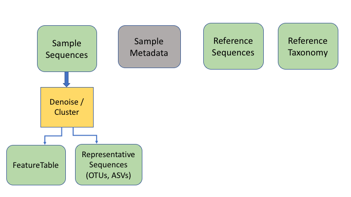
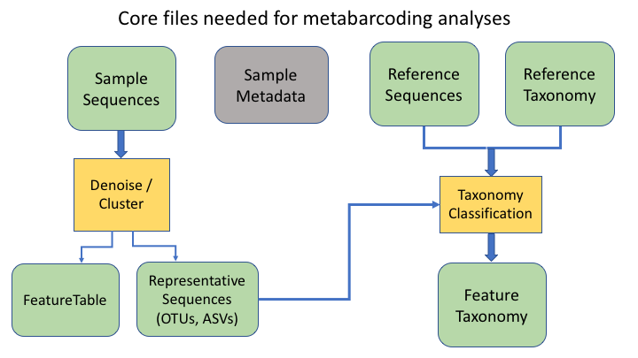
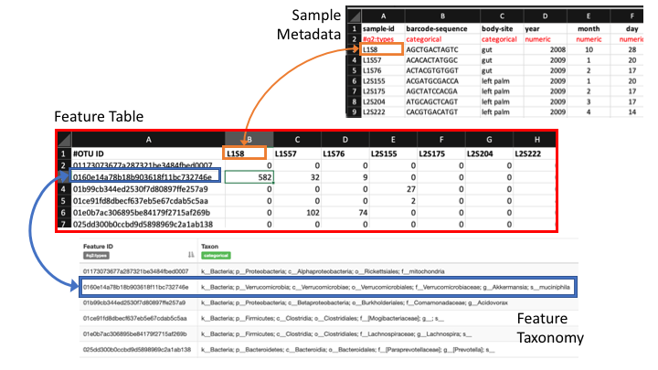
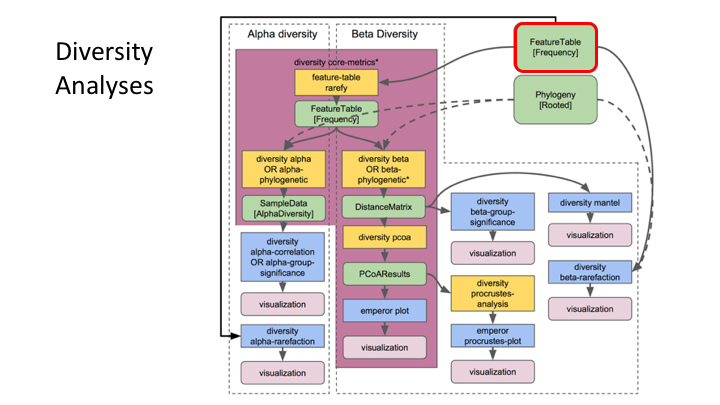

# Metabarcoding Basics

Most metabarcoding pipelines and software use similar tools and methodological approaches, and there are a common set of file types. The methods and the underlying concepts will be presented as we go through the example sets, but to start off, here we introduce a basic tool kit for metabarcoding (aside from the specific software packages themselves), and review the basic file types and formats that will be used for this course, and for most metabarcoding. If you have a firm grasp of these files, then it will be easier to transform your data so it can be used with almost any metabarcoding software package. We will be using Qiime2 for most examples, but we will also show examples of how outputs from other programs can be imported and processed, or just visualised, using Qiime2.

## Basic tool kit

- The terminal, aka Command Line Interface (CLI).

- A text editor. Two of the best that can work on any platform are [**Sublime Text**](https://www.sublimetext.com/) and [**Visual Studio Code**](https://code.visualstudio.com/). For Macs, [**BBEdit**](https://www.barebones.com/products/bbedit/) is a popular choice. And for Windows, [**Notepad++**](https://notepad-plus-plus.org/) is tried and true. 

- [**RStudio**](https://rstudio.com/), an all-in-one package for R.

## Building blocks of metabarcoding

There are six basic kinds of information that are common to all metabarcoding analyses. In some programs, the information may be combined into fewer files. In Qiime2, the files are largely separate. 

The first two file types have to do with your sample data: your sequence data, and the metadata holding information about each sample. The next two are for the taxonomic references that are used to determine the species composition of the samples. 

The next two information types come after clustering the sample sequences. The general Qiime2 terminology for these are the *representative sequences* and the *feature table*. The representative sequences (rep seqs) are also known as *Operational Taxonomic Units* (OTUs) or *Amplicon Sequence Variants* (ASVs), depending on how they are produced (e.g. clustering or denoising). The last type is a table that specifies how many sequences of each rep seq are found in each sample.

 

An additional important type is the product of taxonomy classification of the representative sequences, here called the *feature taxonomy*

## Feature tables are key to metabarcoding analyses

The feature table ties together many sources of information in your analysis. It combines the per sample frequencies of each rep seq, and to its taxonomic assignment, and these can be linked to the sample metadata. 

Feature Tables are the centre of multiple downstream analyses

