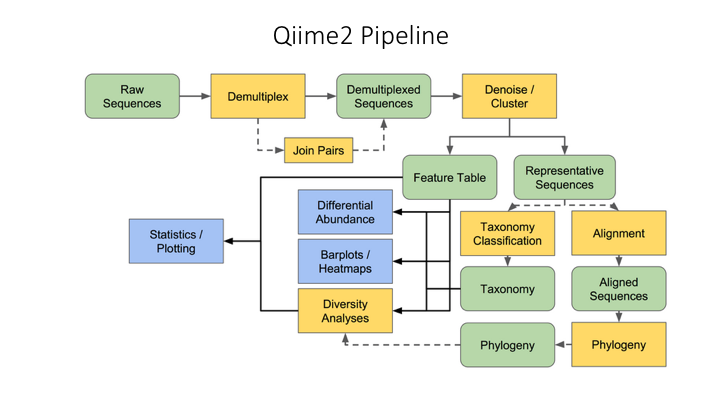

# Overview of Qiime2

The [**Qiime2 docs webpage**](https://docs.qiime2.org/2019.10/) has all the information you need to get started. Including a [**detailed overview**](https://docs.qiime2.org/2019.10/tutorials/overview/) of the available plugins and links to the concepts involved. Here we will just begin the guided tour and explain how the present workshop will incorporate the Qiime2 resources, and explain how to integrate those those tools with other metabarcoding programs and resources. This is only a starting point, and after this you should be able to go and try any of the other tutorials on the website with your own data.

Here is an overview of the Qiime2 workflow:

### Most metabarcoding pipelines have similar steps

### Risk of 'copy/paste' tutorials

Going through the tutorial, merely copying and pasting the commands:

...Has the risk of not absorbing the information as you go through:

The problem is that often you do not want to start at the beginning or finish at the end

This workshop will attempt to help you work through many of the examples yourself, so you will be able to better utilise the resources.

### Qiime2 basics

Here is an example process, with outputs and visualisations added so you can see how you can monitor the progress.

And here is the same process, with exports to flat files

## Tour of Qiime2 website

Now we will look over the resources on the [**Qiime2 website**](https://docs.qiime2.org/2019.10/)

